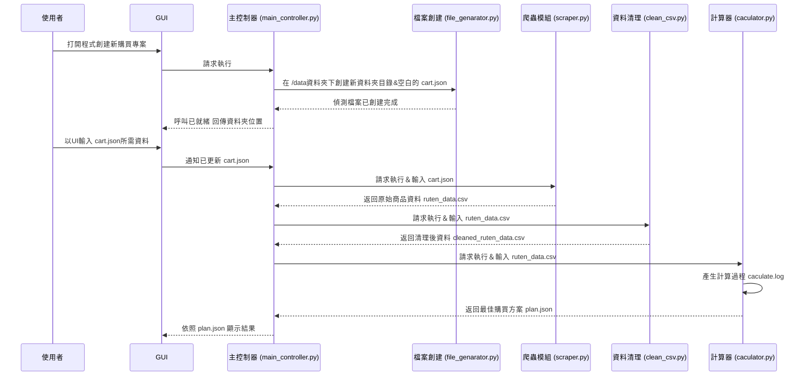

## 系統架構與流程



## 檔案目錄
每當單次使用 main_controller.py 都會在/data下創建一個名字是 年月日_時分秒 的資料夾

```mermaid
flowchart TB
    Root["/data"] --> Src@{ label: "<span style=\"caret-color:\">%Y%m%d_%H%M%S（單次輸出資料夾）</span>" }
    Src --> Components["cart.json"] & Utils["ruten_data.csv"] & n1["cleaned_ruten_data.csv"] & n2["caculate.log"] & n3["plan.json<br>"]

    Src@{ shape: rect}