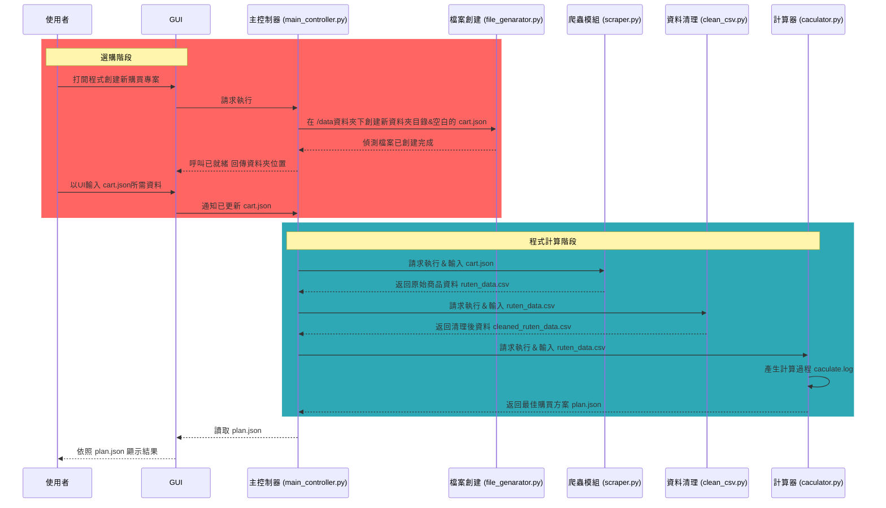
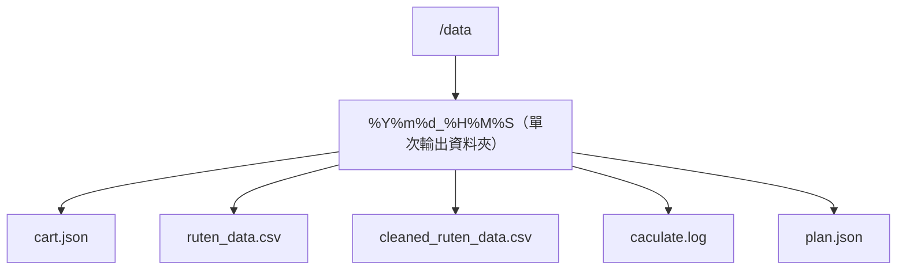

## 系統架構與流程

## 檔案目錄
每當單次使用 main_controller.py 都會在/data下創建一個名字是 年月日_時分秒 的資料夾

## GUI 開發接口說明

本系統已預留以下接口供未來圖形介面 (GUI) 開發整合使用：

1.  **一鍵執行 (`start_process`)**
    *   **位置**: `main_controller.py` -> `start_process()`
    *   **用途**: 自動執行完整流程（建檔 -> 爬蟲 -> 清理 -> 計算）。
    *   **回傳**: 該次任務的資料夾路徑。

2.  **分段控制 (`MainController` Class)**
    *   **位置**: `main_controller.py` -> `MainController` 類別
    *   **方法**:
        *   `initialize_project()`: 建立專案資料夾。
        *   `run_scraper()`: 執行爬蟲。
        *   `run_cleaner()`: 執行資料清理。
        *   `run_calculator()`: 執行最佳化計算。
    *   **用途**: 允許 GUI 逐步執行並更新進度條或狀態顯示。

3.  **人機互動暫停點 (`wait_for_user_input`)**
    *   **位置**: `main_controller.py` -> `wait_for_user_input()`
    *   **用途**: 流程暫停點。GUI 可在此時彈出視窗讓使用者編輯 `cart.json`，確認後再繼續。

4.  **專案路徑獲取 (`create_project_environment`)**
    *   **位置**: `file_genarator.py` -> `FileGenerator.create_project_environment()`
    *   **用途**: 取得當前任務的絕對路徑，方便 GUI 讀取產出的 `plan.json` 或開啟資料夾。

## GUI功能說明

它的主要用途是讓使用者透過直觀的 UI 介面創建一次購買，用 UI 快速填寫`cart.json`中的資料，最後讀取`paln.json`並以UI介面呈現結果。

1. **開始階段**
    * 有創建新購物車的按鈕，同時掃描`data/`目錄下有`plan.json`的資料夾，呈現過去已規劃專案的結果方便使用者回頭查看

2. **選購階段**
    * 透過UI方式輸入`cart.json`所需資料，細節如以下呈現

        **`global_settings`購物設定**

        * 預設運費`default_shipping_cost`： 設定搜尋時預期負擔的基礎運費。
        * 賣家低消`min_purchase_limit`：可設定每間賣家的低消金額。
        * 排除關鍵字`global_exclude_keywords`： 內建多個常用排除詞（如：卡套、桌墊、損卡、福袋、影印等），防止搜尋到非卡片本體的商品。使用者也可以自訂新的關鍵字。
        * 賣家黑名單： 填入不想交易的賣家編號。
        
        **`shopping_cart`智慧型購物車管理**

        * 卡片名稱`card_name_zh` & 所需數量`required_amount`： 可以新增多張卡片，設定中文名稱與需要的數量。
        * 卡片編號 (Target IDs)： 這是該工具最核心的輸入項。
            * 輸入限制： 系統會自動強制鎖定在英數輸入（自動過濾掉中文或特殊符號）。
            * 自動格式化： 當你輸入空格時，它會自動轉換為連字號 -（例如輸入 QCAC JP010 會自動變成 QCAC-JP010），且全部轉為大寫，確保符合 TCG 官方資料庫的標準格式。

        **即時預覽與雙向編輯**

        * 即時產出： 右側面板會隨著左側 UI 的操作，即時更新 JSON 程式碼。
        * 雙向同步： 你可以直接在右側的黑色編輯器中貼上舊有的 JSON 代碼，左側的 UI 介面會自動同步讀取並顯示內容，方便二次編輯。

3. **程式計算階段**
    * 使用者完成選購後按下按鈕送出計算，按照既定流程跑完計算後即完成

4. **查看結果階段**
    * GUI讀取目錄下的`plan.json`並以其資料內的結構列出結果
    * 依照每張卡的`product_id`設立超連結讓使用者能直接點擊去購買商品 格式如下
    `https://www.ruten.com.tw/item/show?product_id`

啟動程式 `streamlit run app.py`