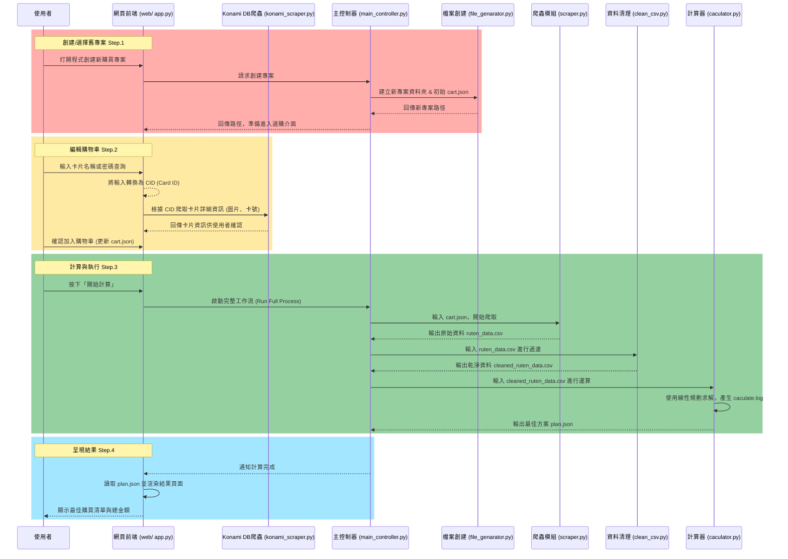
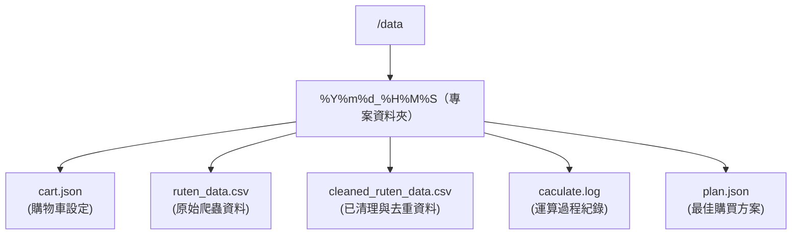

# YGOscraper 遊戲王卡片比價自動化系統

這是一個專為遊戲王卡片玩家設計的自動化比價工具。它結合了現代化的網頁介面 (GUI) 與強大的後端爬蟲及演算法，能協助您在露天拍賣上找出「總價最低（含運費）」的最佳購買組合。

## 系統架構與流程

```mermaid
sequenceDiagram
    participant 使用者
    participant 網頁前端 (web/ app.py)
    participant Konami DB爬蟲 (konami_scraper.py)
    participant 主控制器 (main_controller.py)
    participant 檔案創建 (file_genarator.py)
    participant 爬蟲模組 (scraper.py)
    participant 資料清理 (clean_csv.py)
    participant 計算器 (caculator.py)

    rect rgba(255, 102, 99, 0.53)
    note over 使用者,網頁前端 (web/ app.py): 創建/選擇舊專案 Step.1
    使用者->>網頁前端 (web/ app.py): 打開程式創建新購買專案
    網頁前端 (web/ app.py)->>主控制器 (main_controller.py): 請求創建專案
    主控制器 (main_controller.py)->>檔案創建 (file_genarator.py): 建立新專案資料夾 & 初始 cart.json
    檔案創建 (file_genarator.py)-->>主控制器 (main_controller.py): 回傳新專案路徑
    主控制器 (main_controller.py)-->>網頁前端 (web/ app.py): 回傳路徑，準備進入選購介面
    end

    rect rgba(255, 219, 99, 0.59)
    note over 使用者,網頁前端 (web/ app.py): 編輯購物車 Step.2
    使用者->>網頁前端 (web/ app.py): 輸入卡片名稱或密碼查詢
    網頁前端 (web/ app.py)-->>網頁前端 (web/ app.py): 將輸入轉換為 CID (Card ID)
    網頁前端 (web/ app.py)->>Konami DB爬蟲 (konami_scraper.py): 根據 CID 爬取卡片詳細資訊 (圖片、卡號)
    Konami DB爬蟲 (konami_scraper.py)-->>網頁前端 (web/ app.py): 回傳卡片資訊供使用者確認
    使用者->>網頁前端 (web/ app.py): 確認加入購物車 (更新 cart.json)
    end

    rect rgba(64, 171, 86, 0.56)
    note over 使用者,網頁前端 (web/ app.py): 計算與執行 Step.3
    使用者->>網頁前端 (web/ app.py): 按下「開始計算」
    網頁前端 (web/ app.py)->>主控制器 (main_controller.py): 啟動完整工作流 (Run Full Process)

    主控制器 (main_controller.py)->>爬蟲模組 (scraper.py): 輸入 cart.json，開始爬取
    爬蟲模組 (scraper.py)-->>主控制器 (main_controller.py): 輸出原始資料 ruten_data.csv
    
    主控制器 (main_controller.py)->>資料清理 (clean_csv.py):輸入 ruten_data.csv 進行過濾
    資料清理 (clean_csv.py)-->>主控制器 (main_controller.py): 輸出乾淨資料 cleaned_ruten_data.csv
    
    主控制器 (main_controller.py)->>計算器 (caculator.py):輸入 cleaned_ruten_data.csv 進行運算
    計算器 (caculator.py)->>計算器 (caculator.py): 使用線性規劃求解，產生 caculate.log
    計算器 (caculator.py)-->>主控制器 (main_controller.py): 輸出最佳方案 plan.json
    end
    
    rect rgba(99, 213, 255, 0.59)
    note over 使用者,網頁前端 (web/ app.py): 呈現結果 Step.4
    主控制器 (main_controller.py)-->>網頁前端 (web/ app.py): 通知計算完成
    網頁前端 (web/ app.py)->>網頁前端 (web/ app.py): 讀取 plan.json 並渲染結果頁面
    網頁前端 (web/ app.py)-->>使用者: 顯示最佳購買清單與總金額
    end
```

## 核心模組功能詳解

### 1. 爬蟲模組 (`scraper.py`)
*   **非同步架構**：採用 `asyncio` 與 `aiohttp`，支援高併發請求，大幅縮短爬取大量卡片的時間。
*   **反爬機制**：內建隨機 User-Agent 切換與自動重試機制 (Retry Strategy)，降低被目標網站封鎖的風險。
*   **精準搜尋**：直接使用使用者指定的「9碼卡號」(如 `DABL-JP035`) 作為關鍵字，確保搜尋結果的相關性。

### 2. 資料清理模組 (`clean_csv.py`)
負責將原始爬蟲資料轉化為可供數學模型使用的乾淨數據，具備以下核心邏輯：
*   **嚴格正則表達式 (Regex) 匹配**：
    *   使用 `(?<![a-zA-Z])卡號(?![0-9])` 規則，精確過濾商品標題。
    *   **防止誤判**：避免將 `YSD5` 誤認為 `SD5`。
    *   **保留彈性**：允許卡號前連接數字 (如 `20AP-JP025` 或賣家自訂編號 `20240101...`)，確保不遺漏正確商品。
*   **智慧去重**：根據商品 ID (`product_id`) 進行去重，防止同一商品因重複爬取而被重複計算庫存。
*   **黑名單與關鍵字過濾**：自動排除設定檔中指定的「黑名單賣家」及包含特定「排除關鍵字」(如：卡套、桌墊) 的商品。

### 3. 最佳化計算器 (`caculator.py`)
*   **數學建模**：使用 **PuLP** 函式庫建立「混合整數線性規劃 (MILP)」模型。
*   **目標函數**：最小化 `(所有商品總價 + 所有產生運費)`。
*   **約束條件**：
    *   滿足使用者對每張卡片的需求數量。
    *   購買數量不可超過賣家庫存。
    *   若向某賣家購買，必須符合該賣家的「最低消費限制」(若有設定)。
    *   若向某賣家購買，必須計算一次運費。

## 檔案目錄結構
每次執行專案時，系統會在 `/data` 目錄下建立一個以時間戳記命名的資料夾，並產生以下關鍵檔案：

```mermaid
flowchart TB
    Root["/data"] --> Src@{ label: "<span style=\"caret-color:\">%Y%m%d_%H%M%S（專案資料夾）</span>" }
    Src --> Config["cart.json<br>(購物車設定)"]
    Src --> RawData["ruten_data.csv<br>(原始爬蟲資料)"]
    Src --> CleanData["cleaned_ruten_data.csv<br>(已清理與去重資料)"]
    Src --> Log["caculate.log<br>(運算過程紀錄)"]
    Src --> Result["plan.json<br>(最佳購買方案)"]

    Src@{ shape: rect}
```

## GUI 功能說明

本系統提供直觀的圖形介面 (基於 Eel 框架)，讓不熟悉程式碼的使用者也能輕鬆操作。

1.  **專案管理 (Start Phase)**
    *   **新建專案**：一鍵建立全新的購物車專案。
    *   **歷史紀錄**：自動掃描 `data/` 目錄，列出過去的計算結果，方便隨時回顧。

2.  **智慧選購 (Shopping Phase)**
    *   **即時查詢**：輸入卡片密碼或名稱，系統即時從 Konami 官方資料庫抓取卡圖與詳細資訊。
    *   **自動格式化**：輸入卡號時 (如 `qcac jp010`)，系統會自動轉大寫並補上連字號 (`QCAC-JP010`)。
    *   **雙向同步**：支援 GUI 表單輸入與 JSON 原始碼編輯，兩邊資料即時同步。
    *   **全域設定**：可調整預設運費、全域低消限制、以及管理黑名單賣家。

3.  **自動化執行 (Execution Phase)**
    *   點擊「開始計算」後，系統將自動依序執行：爬蟲 -> 清理 -> 計算。
    *   介面會顯示即時執行日誌 (Log)，讓您掌握目前進度。

4.  **結果呈現 (Result Phase)**
    *   **最佳方案**：清楚列出應該跟哪些賣家買、買什麼、以及各個賣家的小計與總運費。
    *   **直達連結**：點擊商品名稱可直接開啟露天拍賣頁面進行購買。

## 名詞定義

*   **CID (Card ID)**: Konami 官方資料庫中的唯一識別碼 (例如: `4006`)，用於精確查詢卡片資料。
*   **Card Passcode (卡片密碼)**: 卡片左下角的 8 位數字 (例如: `91509824`)。
*   **Card Number (卡號)**: 卡片圖片右上角的編號，代表特定擴充包與版本 (例如: `DABL-JP035`)，這是搜尋價格的最重要依據。
